  
  
  

 

<h3 align="center">Selected work</h3>

  
  

  
  

 

<h3 align="center">Stack</h3>

  

 

<picture>
  <source media="(prefers-color-scheme: dark)" srcset="https://raw.githubusercontent.com/amenigharbi1O16/amenigharbi1O16/output/snake-dark.svg" />
  <source media="(prefers-color-scheme: light)" srcset="https://raw.githubusercontent.com/amenigharbi1O16/amenigharbi1O16/output/snake-light.svg" />
  
</picture>

